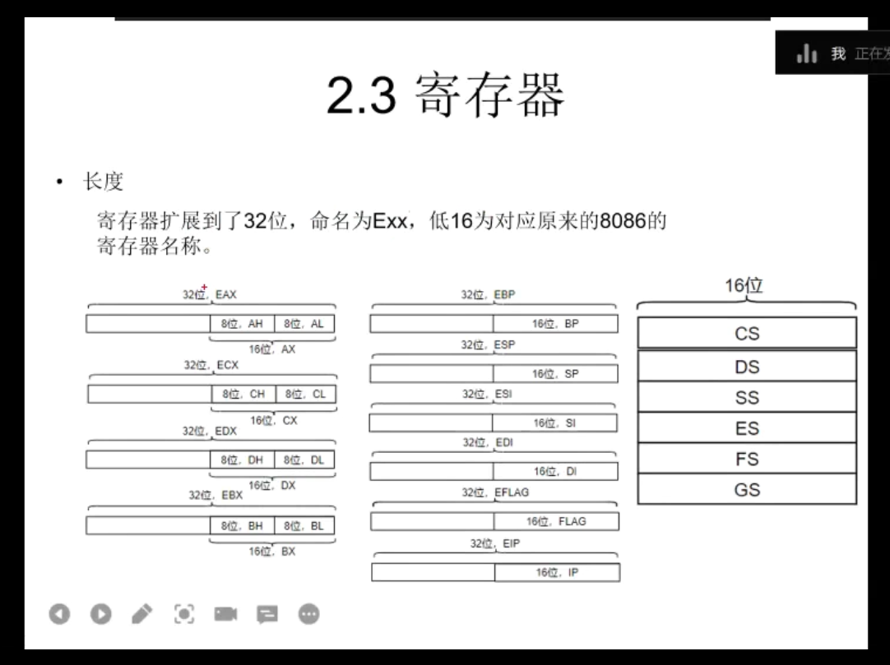

 # masm32
集成了很多系统api可以直接使用

---
# SDK
- 是一组用于开发特定平台、框架或系统应用的工具、库和文档的集合。它帮助开发者更高效地构建程序。
SDK（如 Windows SDK）提供支持两种子系统的工具：
- **CONSOLE**：
    - 有控制台，适合 printf、命令行。
    - 用 main，简单直接。
- **WINDOWS**：
    - 无控制台，适合窗口界面。
    - 用 WinMain，需处理消息循环（如 GetMessage）。

---

# COFF
- **Common Object File Format**，一种通用文件格式，用于目标文件（.obj）、静态库（.lib）和可执行文件（.exe）。
- Windows 的 PE/COFF 格式支持 32 位和 64 位程序。
- 包含：
    - 机器代码。
    - 符号表（调试用）。
    - 重定位信息（链接时用）。
- 在 Visual Studio 中，/COFF 确保 .obj 和 .exe 兼容 Microsoft 工具（默认启用）。

---

# 2.1源文件格式
### 2.1.1 头文件三件套：
- .386
- .model flat,stdcall
- option casemap:NONE
	- 一套满足基本需求的指令集
	- 内存模型：FLAT：内存地址通常被视为一个连续的**线性地址空间**，即整个内存的地址从0到4GB。所有的程序和数据共享这个线性地址空间，不会进行复杂的内存分段和分页。
	- casemap:大小写是否敏感
### 2.1.2 分节
- 32位汇编取消了分段，改用内存属性来划分，称作节（section）、内存区或内存块。
- 节是对程序的逻辑划分，不是内存管理

| 节      | 可读  | 可写  | 可执行 | 备注        |
| ------ | --- | --- | --- | --------- |
| .DATA  | ✔️  | ✔️  |     | 初始化的全局变量  |
| .CONST | ✔️  |     |     | 只读数据区     |
| .DATA? | ✔️  | ✔️  |     | 未初始化的全局变量 |
| .CODE  | ✔️  |     | ✔️  | 代码        |
### 2.1.3 分页
- 相较于碎片化的分段内存管理，分页的内存使用率更高。**极大简化了内存管理**
- **页目录影响范围**：4GB（整个32位虚拟地址空间，1024个页表 × 4MB）。
- **页表影响范围**：4MB（单个页表，1024个页面 × 4KB）。

| 步骤             | 输入                     | 操作                                           | 输出                     |
|------------------|--------------------------|----------------------------------------------|--------------------------|
| **分解地址**     | 虚拟地址 `0x12345678`    | 分割为：页目录索引=72，页表索引=418，偏移=0x678 | 三部分索引               |
| **查页目录**     | CR3=`0x100000`，索引=72  | 访问 `0x100120`，读取页表地址                 | 页表地址 `0x200000`      |
| **查页表**       | 页表=`0x200000`，索引=418 | 访问 `0x200688`，读取物理页面地址             | 页面地址 `0x3000000`     |
| **计算物理地址** | 页面=`0x3000000`，偏移=0x678 | 相加：`0x3000000 + 0x678`                  | 物理地址 `0x3000678`     |

---

### 2.2 ollydbg
- 右键-转到-表达式：输入地址（hex）即可跳转
- ctrl+G直接输入跳转地址
- 对于jmp或者call按回车，直接跳转
- 减号（-）回退，加号（+）前进
- 空格写反汇编，右键可选择撤销
- ctrl+A重新高亮
- 双击寄存器修改
  ![[Pasted image 20250412153744.png]]
- udd：dump遗留的调试数据
- 标签：特指一块内存

### 2.3 寄存器

### 2.4 32位指令
- 原有16位指令基本上都可以使用，中断只有int 3有用，其他的都不用了。
- 可以用enter和leave快速创建栈帧
- pushad,popad：保存所有通用寄存器
- 
## 2.5一些指令

## 常见 JMP 指令类型对比

| 模式            | 汇编形式          | opcode  | 跳转目标类型         | 举例                        | 描述         |
| ------------- | ------------- | ------- | -------------- | ------------------------- | ---------- |
| **短跳（short）** | `jmp rel8`    | `EB`    | 相对地址（+/-127字节） | `EB 69`                   | 指令后偏移，最短   |
| **近跳（near）**  | `jmp rel32`   | `E9`    | 相对地址（±2GB）     | `E9 12 34 00 00`          | 跳转到相对偏移    |
| **间接跳（寄存器）**  | `jmp eax`     | `FF E0` | 绝对地址（来自寄存器）    | `jmp ecx`                 | 跳到寄存器保存的地址 |
| **间接跳（内存）**   | `jmp [addr]`  | `FF 25` | 内存中存的绝对地址      | `jmp [0x12345678]`        | 跳到内存中取出的地址 |
| **远跳（段间）**    | `jmp far ptr` | `EA`    | 段:偏移（16:32）    | `jmp far ptr 0x08:0x1234` | 系统编程用，稀有   |

---

# 3 资源和联合编译
- 资源的使用
- c如何调用汇编，汇编如何调用c
- 如何用汇编写dll
### 3.1 资源
- 这里的资源是指window api的资源，比如：菜单、对话框、图标、字符串等
- .rc:资源文件，用于编译器编译后嵌入到可执行文件中；.res文件：.rc文件编译后的二进制文件
### 3.1.1 C库函数的使用
- msvcrt.inc
- msvcrt.lib
- crt_xxx
### 3.1.2 联合编译
- 汇编调用C -链接阶段：C语言编译成obj给汇编代码链接用
- C调用汇编-同上，都是通过obj调用

### 3.1.3 DLL&LIB
- dll是一种泛用性很强的可执行文件格式，用于动态链接一些函数
- **.lib 文件**：
    - **静态库**：不包含导出表，直接包含编译后的代码和符号表，链接时嵌入到 .exe。
    - **导入库**：也不直接包含导出表，但记录了 DLL 导出符号的信息，供linker使用。
- **.dll 文件**：
    - 包含导出表（Export Table），列出可供外部调用的函数、变量等符号的名称和地址，用于动态链接。
- link /subsystem /dll /def:test.def test.obj
## 动态链接&静态链接：

|项目|静态链接 `.lib`|动态链接 `.dll + .lib`（隐式）或 `.dll`（显式）|
|---|---|---|
|编译时|把 `.lib` 中函数代码复制到 `.exe`|只引用 `.dll` 里的函数地址|
|运行时|不需要 `.lib`、`.dll`|必须有 `.dll`（否则程序报错）|
|文件体积|比较大（代码被复制）|较小（代码独立在 DLL 中）|
|更新方式|更新程序必须重新编译|只换 DLL 即可|
|可重用性|不共享代码|多个程序可共享同一个 DLL|
|调试麻烦|一般较简单|有时 DLL 调不进去或路径错|
|用法|`#pragma comment(lib, "xxx.lib")`|隐式：加 `.lib`；显式：用 `LoadLibrary`|

---

### 3.1.4 内联汇编
- 内联汇编不能写外部汇编器的==高级伪指令==，但可以用==外部汇编器的关键词==
- __asm __asm{}
- __declspec(naked)用于生成裸函数
- __LOCAL_SIZE 内置宏，让编译器计算局部变量大小
- 为什么用内联汇编：
	- 为了查看未公开的结构体
	- 提高效率
